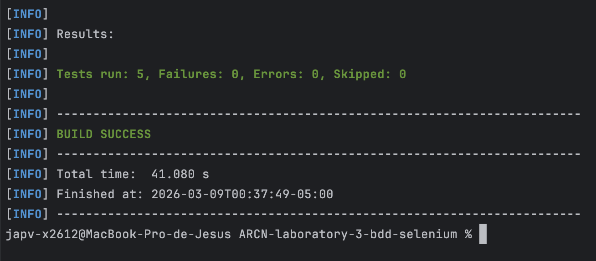
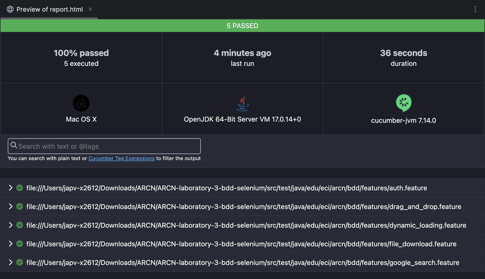
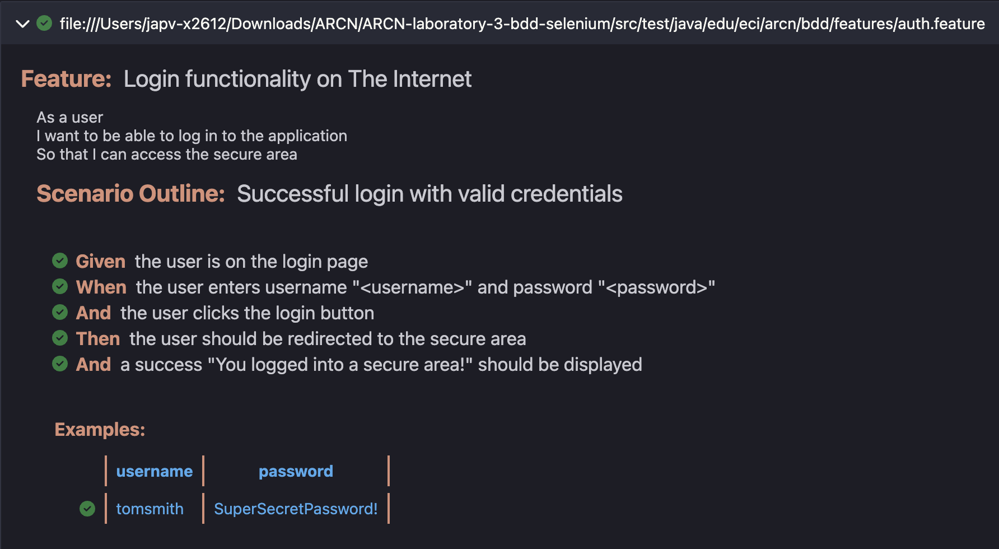
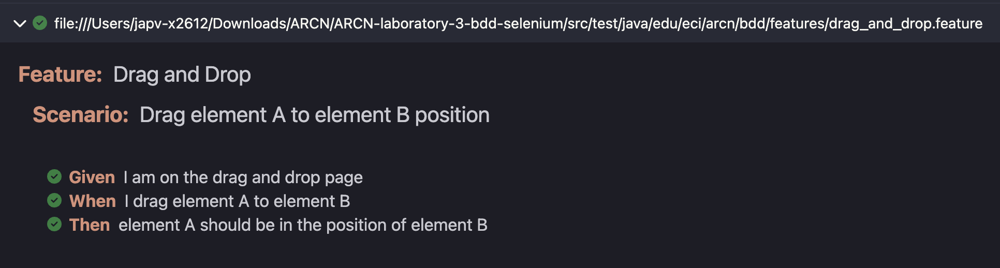
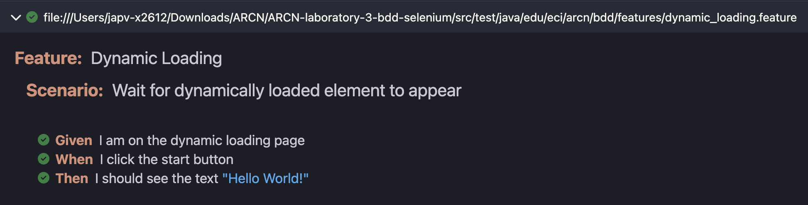
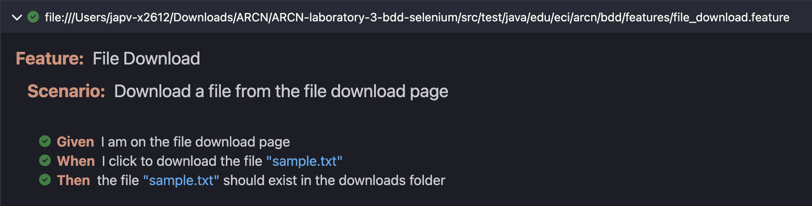
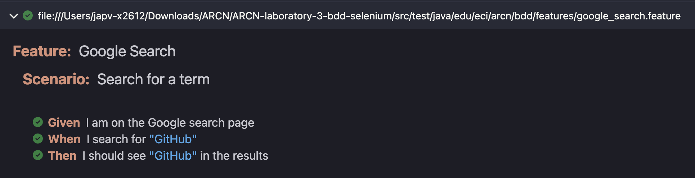

# 🧪 BDD Selenium Laboratory
## Behavior-Driven Development with Cucumber, Selenium WebDriver and Java in GitHub Codespaces

[](https://www.oracle.com/java/)
[](https://maven.apache.org/)
[](https://www.selenium.dev/)
[](https://cucumber.io/)
[](https://junit.org/junit4/)
[](https://github.com/features/codespaces)
[](LICENSE)

> **Business-Centric Architecture (ARCN_M)** — Laboratory 3  
> Practical application of **Behavior-Driven Development (BDD)** through acceptance testing with *Cucumber* (Gherkin), *Selenium WebDriver*, and the **Page Factory** pattern in Java, validated against real web scenarios from [The Internet](https://the-internet.herokuapp.com/).

---

## 📋 **Table of Contents**

- [Overview](#-overview)
- [BDD Methodology](#-bdd-methodology)
- [Page Factory Pattern](#-page-factory-pattern)
- [Project Structure](#-project-structure)
- [Features and Scenarios](#-features-and-scenarios)
- [Testing Results](#-testing-results)
- [Installation and Usage](#-installation-and-usage)
- [Technologies Used](#-technologies-used)
- [Author](#-author)
- [License](#-license)
- [Additional Resources](#-additional-resources)

---

## 🌟 **Overview**

This laboratory demonstrates the practical application of **Behavior-Driven Development (BDD)** — a software engineering discipline in which acceptance tests are written in plain English _before_ any implementation, bridging communication between business stakeholders and developers.

Using **Cucumber** as the BDD framework, **Selenium WebDriver** as the browser automation engine, and the **Page Factory** design pattern for page abstraction, students implement five real-world acceptance scenarios against publicly available test websites.

### 🎯 Learning Objectives

- ✅ **Understand** the BDD approach and how Gherkin scenarios translate to executable tests
- ✅ **Apply** the Page Factory pattern to encapsulate UI interactions
- ✅ **Implement** acceptance tests for realistic web scenarios
- ✅ **Automate** browser interactions with Selenium WebDriver in headless mode
- ✅ **Generate** structured HTML, JSON, and XML test reports via Cucumber plugins

### 💼 Business Context

In **enterprise software development**, BDD provides measurable benefits:

- 🤝 **Shared understanding**: Gherkin scenarios are readable by developers, testers, and business analysts alike
- 🔧 **Living documentation**: Feature files describe system behavior and stay in sync with the codebase
- 🚀 **Faster feedback**: Acceptance tests catch regressions at the UI layer before reaching production
- 🧪 **Traceability**: Each scenario maps directly to a business requirement
- 💰 **Lower regression cost**: Automated browser tests replace expensive manual verification cycles

---

## 🔄 **BDD Methodology**

**Behavior-Driven Development** extends TDD by shifting the focus from unit behavior to business-facing acceptance criteria. Scenarios are written in **Gherkin** — a structured natural language that follows the *Given-When-Then* format:

| Keyword | Role | Example |
|---------|------|---------|
| `Feature` | Groups related scenarios | `Feature: Google Search` |
| `Scenario` | Describes a single acceptance case | `Scenario: Search for a term` |
| `Given` | Establishes the initial context | `Given I am on the Google search page` |
| `When` | Describes the action taken | `When I search for "GitHub"` |
| `Then` | Asserts the expected outcome | `Then I should see "GitHub" in the results` |

> *"BDD is about having conversations, not writing tests."*  
> — [Dan North](https://dannorth.net/introducing-bdd/), _creator of BDD_

Each Gherkin step maps to a Java method annotated with `@Given`, `@When`, or `@Then` inside a **step definition** class. The **TestRunner** wires everything together via JUnit and `@CucumberOptions`.

---

## 🏗️ **Page Factory Pattern**

**Page Factory** is a Selenium design pattern that encapsulates page element locators and interactions into dedicated **Page Object** classes, initialized lazily via `PageFactory.initElements()`.

### How It Works

Instead of calling `driver.findElement(By.id(...))` scattered across test code, elements are declared once as annotated fields:

```java
@FindBy(id = "username")
private WebElement usernameField;

public LoginPage(WebDriver driver) {
    PageFactory.initElements(driver, this); // injects all @FindBy elements
}
```

Selenium creates a **proxy** for each field — the actual DOM lookup only happens when the element is accessed, not at construction time.

### ✅ Advantages

- **Centralized locators**: a single source of truth per page — HTML changes require updates in only one place
- **Cleaner step definitions**: steps call readable methods (`loginPage.clickLogin()`) instead of raw Selenium calls
- **Lazy initialization**: elements are not fetched until the moment they are needed

### ❌ Disadvantages

- **Runtime failures**: if an element does not exist, the error surfaces at interaction time, not at page construction
- **Proxy complexity**: `List<WebElement>` fields behave differently from single elements — the list is re-fetched on every access
- **Limited flexibility**: complex dynamic locators (e.g., parameterized `By` expressions) are harder to express with `@FindBy`

---

## 📁 **Project Structure**

```
bdd-selenium/
│
├── .devcontainer/
│   └── devcontainer.json
│
├── assets/
│   └── images/
│       ├── 01-all-scenarios-passed.png
│       ├── 02-html-report-overview.png
│       ├── 03-login-scenario-passed.png
│       ├── 04-drag-and-drop-scenario-passed.png
│       ├── 05-dynamic-loading-scenario-passed.png
│       ├── 06-file-download-scenario-passed.png
│       └── 07-google-search-scenario-passed.png
│
├── src/
│   ├── main/
│   │   └── java/edu/eci/arcn/bdd/
│   │       └── App.java
│   │
│   └── test/
│       └── java/edu/eci/arcn/bdd/
│           ├── features/
│           │   ├── auth.feature
│           │   ├── drag_and_drop.feature
│           │   ├── dynamic_loading.feature
│           │   ├── file_download.feature
│           │   └── google_search.feature
│           ├── pages/
│           │   ├── DragAndDropPage.java
│           │   ├── DynamicLoadingPage.java
│           │   ├── FileDownloadPage.java
│           │   └── LoginPage.java
│           ├── resources/
│           │   └── cucumber.properties
│           ├── runners/
│           │   └── TestRunner.java
│           └── steps/
│               ├── DragAndDropSteps.java
│               ├── DynamicLoadingSteps.java
│               ├── FileDownloadSteps.java
│               ├── LoginSteps.java
│               └── SearchSteps.java
│
├── pom.xml
├── LICENSE
└── README.md
```

---

## 🎮 **Features and Scenarios**

This laboratory implements <u>5 acceptance features</u> covering a range of UI interaction patterns:

### 🔐 Authentication — `auth.feature`

Validates the login flow against [The Internet — Login Page](https://the-internet.herokuapp.com/login) using the Page Factory pattern on form fields.

```gherkin
Feature: Authentication

  Scenario: Successful login with valid credentials
    Given the user is on the login page
    When the user enters username "tomsmith" and password "SuperSecretPassword!"
    And the user clicks the login button
    Then the user should be redirected to the secure area
    And a success "You logged into a secure area!" should be displayed
```

### 🔍 Google Search — `google_search.feature`

Verifies that a search term appears in Google results — a fundamental smoke test for search-driven flows.

```gherkin
Feature: Google Search

  Scenario: Search for a term
    Given I am on the Google search page
    When I search for "GitHub"
    Then I should see "GitHub" in the results
```

### 🖱️ Drag and Drop — `drag_and_drop.feature`

Exercises the **Selenium Actions API** to simulate pointer drag interactions between two DOM elements.

```gherkin
Feature: Drag and Drop

  Scenario: Drag element A to element B position
    Given I am on the drag and drop page
    When I drag element A to element B
    Then element A should be in the position of element B
```

### ⏳ Dynamic Loading — `dynamic_loading.feature`

Validates **explicit wait** handling using `WebDriverWait` and `ExpectedConditions` for asynchronously rendered content.

```gherkin
Feature: Dynamic Loading

  Scenario: Wait for dynamically loaded element to appear
    Given I am on the dynamic loading page
    When I click the start button
    Then I should see the text "Hello World!"
```

### 📥 File Download — `file_download.feature`

Tests browser-triggered file downloads by configuring a custom ChromeOptions download directory and polling the filesystem for the downloaded file.

```gherkin
Feature: File Download

  Scenario: Download a file from the file download page
    Given I am on the file download page
    When I click to download the file "1.txt"
    Then the file "1.txt" should exist in the downloads folder
```

---

## ✅ **Testing Results**

### All Scenarios Passed

All <u>5 scenarios</u> executed successfully with **0 failures** and **0 errors**:



### Cucumber HTML Report — Overview



### Authentication Scenario



### Drag and Drop Scenario



### Dynamic Loading Scenario



### File Download Scenario



### Google Search Scenario



### Running Tests Locally

```bash
# Compile the project
mvn compile

# Run all BDD scenarios
mvn test

# View HTML report (download and open in browser)
open target/HtmlReports/report.html
```

---

## 🚀 **Installation and Usage**

### Prerequisites

- **Java 17+** — [Download Java](https://www.oracle.com/java/technologies/downloads/)
- **Maven 3.8+** — [Install Maven](https://maven.apache.org/install.html)
- **Git** — [Install Git](https://git-scm.com/downloads)
- **Google Chrome** — Required for ChromeDriver via WebDriverManager

### Local Setup

```bash
# Clone the repository
git clone https://github.com/JAPV-X2612/ARCN-laboratory-3-bdd-selenium.git
cd ARCN-laboratory-3-bdd-selenium

# Compile the project
mvn compile

# Run all acceptance tests
mvn test

# View the HTML report
open target/HtmlReports/report.html
```

### GitHub Codespaces Setup

1. Navigate to the repository on GitHub
2. Click **Code** → **Codespaces** → **Create codespace on main**
3. Wait for the container to initialize via `.devcontainer/devcontainer.json`
4. Run all scenarios from the integrated terminal:

```bash
mvn test
```

### Generate the Project from Scratch

```bash
mvn archetype:generate \
  -DgroupId=edu.eci.arcn \
  -DartifactId=bdd-selenium \
  -Dpackage=edu.eci.arcn.bdd \
  -DarchetypeArtifactId=maven-archetype-quickstart \
  -DinteractiveMode=false
```

---

## 🛠️ **Technologies Used**

| Technology | Version | Purpose |
|------------|---------|---------|
| **Java** | 17+ | Primary programming language |
| **Maven** | 3.8+ | Build automation and dependency management |
| **Selenium WebDriver** | 4.15.0 | Browser automation engine |
| **WebDriverManager** | 5.6.3 | Automatic ChromeDriver binary management |
| **Cucumber Java** | 7.14.0 | BDD framework — Gherkin step binding |
| **Cucumber JUnit** | 7.14.0 | JUnit integration for Cucumber test runner |
| **JUnit** | 4.13.2 | Test execution and assertions |
| **SLF4J Simple** | 2.0.9 | Logging provider for Selenium internals |
| **GitHub Codespaces** | — | Cloud-based development environment |

### Key Maven Dependencies

```xml
<dependencies>
    <!-- Selenium WebDriver -->
    <dependency>
        <groupId>org.seleniumhq.selenium</groupId>
        <artifactId>selenium-java</artifactId>
        <version>4.15.0</version>
    </dependency>

    <!-- WebDriverManager -->
    <dependency>
        <groupId>io.github.bonigarcia</groupId>
        <artifactId>webdrivermanager</artifactId>
        <version>5.6.3</version>
    </dependency>

    <!-- Cucumber Java -->
    <dependency>
        <groupId>io.cucumber</groupId>
        <artifactId>cucumber-java</artifactId>
        <version>7.14.0</version>
    </dependency>

    <!-- Cucumber JUnit -->
    <dependency>
        <groupId>io.cucumber</groupId>
        <artifactId>cucumber-junit</artifactId>
        <version>7.14.0</version>
        <scope>test</scope>
    </dependency>

    <!-- JUnit -->
    <dependency>
        <groupId>junit</groupId>
        <artifactId>junit</artifactId>
        <version>4.13.2</version>
        <scope>test</scope>
    </dependency>
</dependencies>
```

---

## 👥 **Author**

<table>
  <tr>
    <td align="center">
      <a href="https://github.com/JAPV-X2612">
        
        <br />
        <sub><b>Jesús Alfonso Pinzón Vega</b></sub>
      </a>
      <br />
      <sub>Full Stack Developer</sub>
    </td>
  </tr>
</table>

---

## 📄 **License**

This project is licensed under the **Apache License, Version 2.0** — see the [LICENSE](LICENSE) file for details.

```
Copyright 2026 Jesús Alfonso Pinzón Vega

Licensed under the Apache License, Version 2.0 (the "License");
you may not use this file except in compliance with the License.
You may obtain a copy of the License at

    http://www.apache.org/licenses/LICENSE-2.0

Unless required by applicable law or agreed to in writing, software
distributed under the License is distributed on an "AS IS" BASIS,
WITHOUT WARRANTIES OR CONDITIONS OF ANY KIND, either express or implied.
See the License for the specific language governing permissions and
limitations under the License.
```

---

## 🔗 **Additional Resources**

### Behavior-Driven Development

- [Dan North — Introducing BDD](https://dannorth.net/introducing-bdd/)
- [Cucumber Documentation](https://cucumber.io/docs/cucumber/)
- [Gherkin Reference](https://cucumber.io/docs/gherkin/reference/)
- [BDD Guide — Baeldung](https://www.baeldung.com/cs/bdd-guide)

### Selenium WebDriver

- [Selenium Official Documentation](https://www.selenium.dev/documentation/)
- [Selenium Java API](https://www.selenium.dev/selenium/docs/api/java/)
- [WebDriverManager — GitHub](https://github.com/bonigarcia/webdrivermanager)
- [Page Factory — Selenium Wiki](https://github.com/SeleniumHQ/selenium/wiki/PageFactory)

### Java & Maven

- [Oracle Java 17 Documentation](https://docs.oracle.com/en/java/javase/17/)
- [Maven Getting Started Guide](https://maven.apache.org/guides/getting-started/)
- [Maven Surefire Plugin](https://maven.apache.org/surefire/maven-surefire-plugin/)

### Test Sites

- [The Internet — Herokuapp](https://the-internet.herokuapp.com/)

### Clean Code & Best Practices

- [Robert C. Martin — *Clean Code*](https://www.oreilly.com/library/view/clean-code-a/9780136083238/)
- [Page Object Model — Martin Fowler](https://martinfowler.com/bliki/PageObject.html)

---

⭐ **If you found this laboratory helpful, please consider giving it a star!** ⭐
